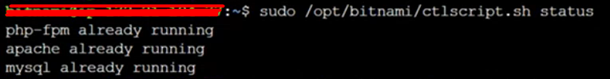
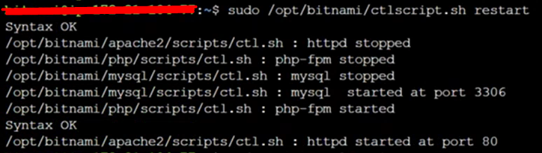

# bitnami-start-or-stop-services
Bitnami stack includes a control script that lets you easily stop, start and restart services.

https://docs.bitnami.com/aws/faq/administration/control-services/

## Obtain the status of a service:

```
sudo /opt/bitnami/ctlscript.sh status
```



## Restart the services by running the script without any arguments:

```
sudo /opt/bitnami/ctlscript.sh restart
```


## Call it without any service name arguments to start all services:

```
sudo /opt/bitnami/ctlscript.sh start
```

## Use this script to stop all services:

```
sudo /opt/bitnami/ctlscript.sh stop
```

## Use it to restart a single service, such as Apache only, by passing the service name as argument:

```
sudo /opt/bitnami/ctlscript.sh restart apache
```